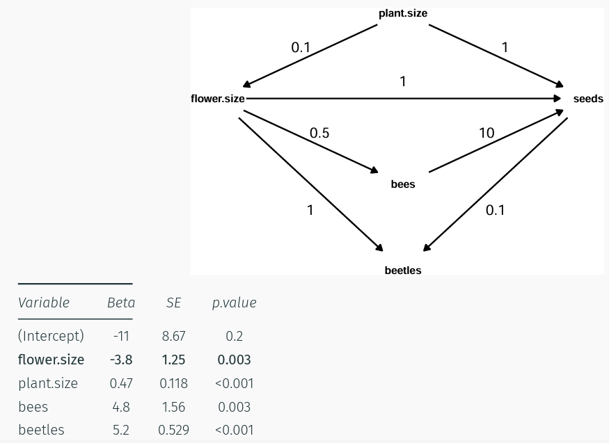
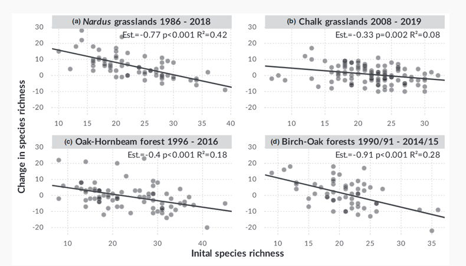

**Confounder:** factor de confusioón. Flechas tenedor

Direccion de las flechas es muy importante en un diagrama causal (vemos las relaciones). Podemos tener un factor que afecta positivamente, pero a su vez tiene efecto que influye sobre otro.

El patrón en triangulo es estructura de confounding (cuando el confounder esta arriba).

El 6.6 es el efecto causal real del tamaño de la flor.

**Mediator:** esta en medio: flores mas grandes atraen a mas abejas y mas abejas significa más semillas. El efecto de flower size directo es menor pero tiene un efecto indirecto para las abejas.

**Collinder:** las flechas apuntan a el. Flores mas grandes atraen a mas escarabajos, pero los capitulos con mas semillas tambien los atraen, porque se comen las semillas.

Induce un sesgo de colision COLLIDER BIAS. Inducimos sin querer una relacion negativa entre flower size i seeds. Factor de colisión. Caso de entrevistar solo a la gente no-divorciada. Hay un sesgo, solo entrevistas a los no divorciados, y parece que tener muchos hijos mal.

Que ocurre primero? este podria ser el agente principal causal.

Estos diagramas pueden tener en cuenta las susecion temporal.

**Que hacemos?**

El 2.1 es solo el efecto directo, el resto de 8.8 es el efecto indirecto. POdemos descomponerlo. Si solo queremos el efecto total quitamos las abejas. El plant size si que tenemos que dejarlo sino la pendiente estaria sesgada.

Dagify. Funciones de check_dag! te detecta quien afecta a quien, eliminamos el collinder. El mismo programa te avisa.

## Paradoja de Simpson

La pendiente de un predictor cambia de signo segun la variable.

Puede que tengamos dos grupos y el modelo no lo sepa. Que tengamos parcelas diferentes, que nos estemos dejando una variable que define.

Esto lo podemos corregir con un buen diagrama causal. Obteniendo la información de forma externa.

# **Regresion a la media**

dos medidas relacionadas con correlacion no perfecta, vamos a encontrar este problema. Es por un efecto estadistico. Comparacion cambio vs valor inicial, sospechamos de este artefacto estadistico. En vez de modelizar cambio con valor inicial, modelizamos valor final vs valor inicial.
